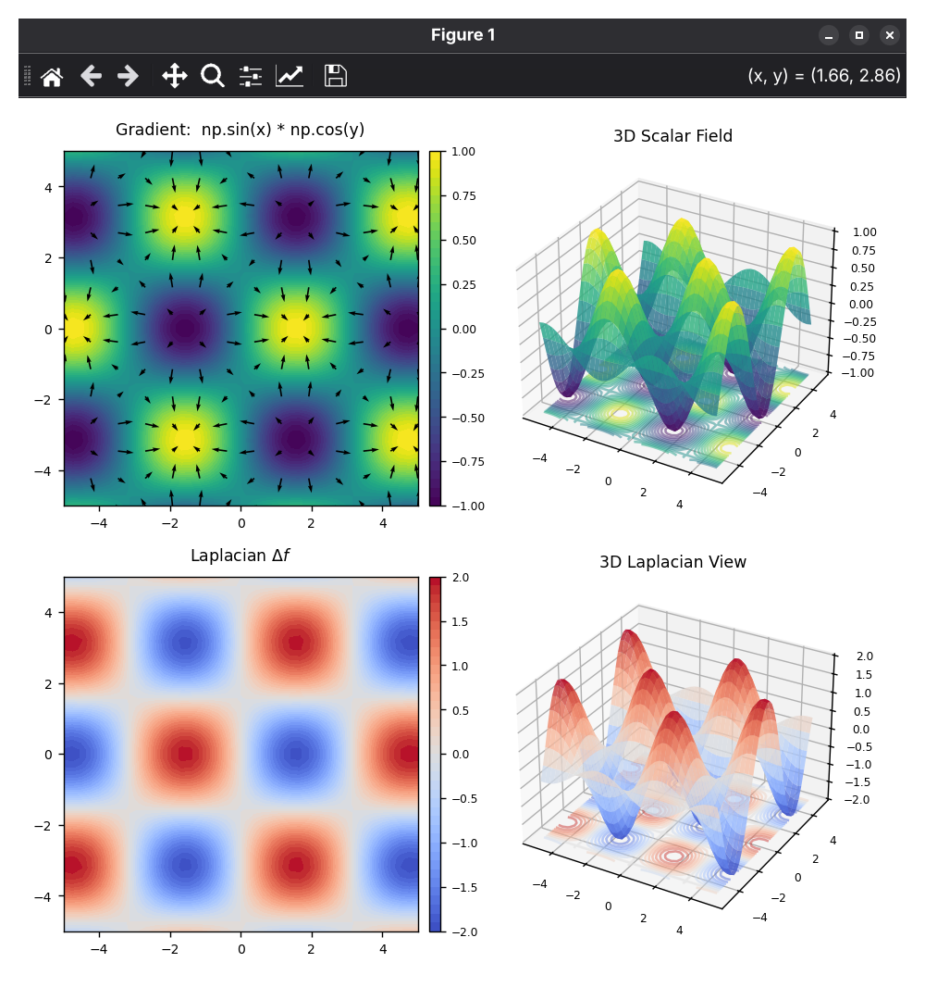
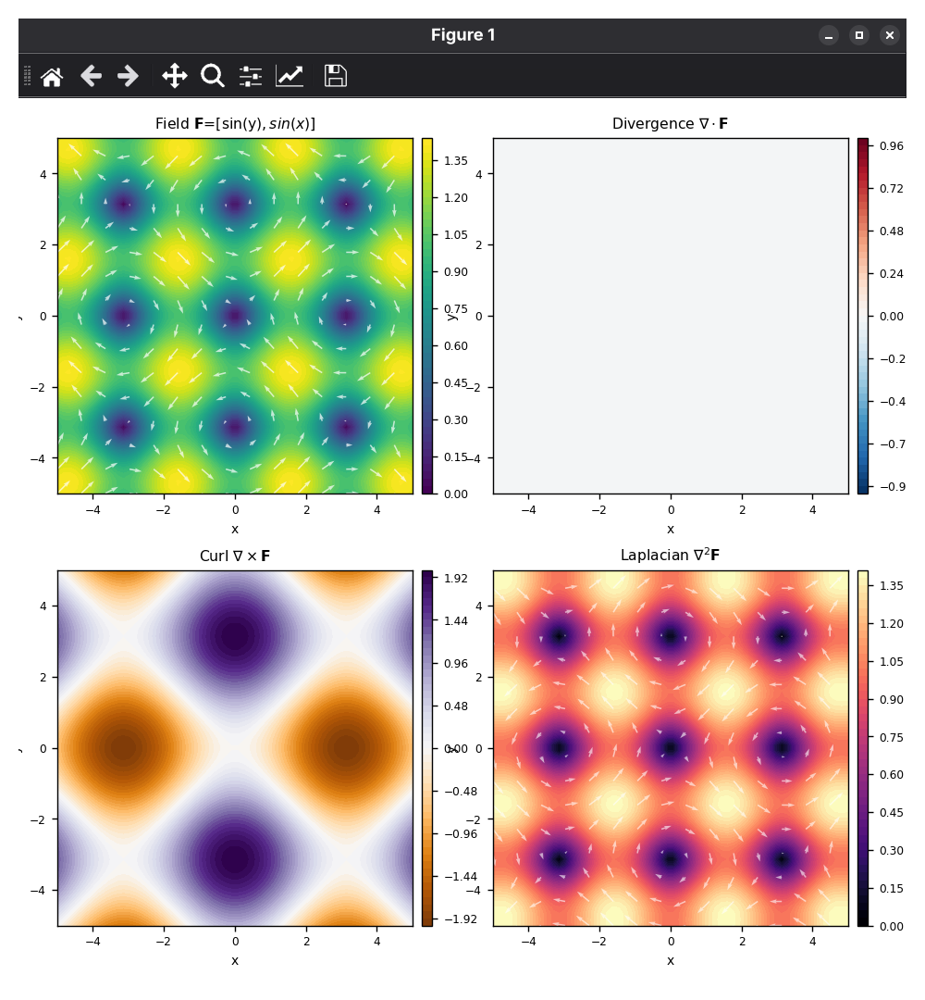

# GradLaplace 📐

A high-performance Python visualization suite for exploring **Scalar** and **Vector** fields. This project provides a clean, 2D/3D synchronized view of gradients, divergence, curl, and Laplacian operators with precision noise-filtering.

## 🚀 Features
- **Dynamic Expression Parsing**: Enter any function like `x**2 + y**2` or `np.sin(x)*np.cos(y)` directly in the terminal.
- **Precision Floating-Point Fixing**: Automatic rounding and boundary-order correction to prevent "noise glitches" on constant Laplacian fields (like $x^2 + y^2 = 4$).
- **Multi-View Dashboards**: 
    - **Scalar Script**: Gradient Field (2D), Scalar Surface (3D), and Laplacian (2D/3D).
    - **Vector Script**: Field Magnitude (2D), Divergence, Curl, and Vector Laplacian.
- **Optimized Layout**: Square 2D subplots with synchronized 3D projections and floor contours.

---

## 📸 Visualizations

### Scalar Field Analysis
Visualizing the gradient and curvature of scalar functions.


### Vector Field Analysis
Visualizing flow, source/sink (divergence), and rotation (curl).


---

## 🛠️ Requirements
- Python 3.x
- NumPy
- Matplotlib

```bash
pip install numpy matplotlib
